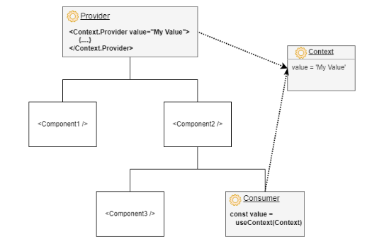

## useContext Hook

 The useContext hook in React is a built-in hook that allows functional components to access and consume context values directly, making it easier and more intuitive to work with React Context.
- Context in React is a feature that allows you to share values (or "state") between components without having to pass props manually at every level of the component tree.
- It provides a way to avoid "prop drilling," which occurs when data is passed down through many layers of nested components, even if intermediate components don't use the data.
- The useContext hook is a powerful tool in React, simplifying data sharing and improving code readability when combined with the Context API.

### Why is Context Needed

- **Avoid Prop Drilling:** It reduces the complexity of passing props through deeply nested component trees.
- **Global State Management:** It helps manage shared states like themes, authentication data, or language preferences across the app.
- **Simplifies Code:** Context makes code cleaner and easier to maintain when many components need access to the same state or data.

#### React Context



**Syntax**
`const contextValue = useContext(MyContext);`
where,
- **MyContext:** The context object created using React.createContext.
- **contextValue:** The value provided by the nearest Provider component in the component tree.

### Steps to Use useContext

- **Create a Context:** Use React.createContext to create a context object.
`const MyContext = React.createContext(MyValue);`

- **Provide a Value:** Use the Provider component to supply a value to the context.
```
<MyContext.Provider value={value}>
<ChildComponent />
</MyContext.Provider>
```
- **Consume the Value:** Use useContext in any functional component to access the context value.
`const value = useContext(MyContext);`

### Benefits of useContext


- **Simplicity:** It removes the need for `<Context.Consumer>`, making the code shorter and cleaner.
- **Readability:** Using useContext results in more readable and maintainable functional components.
- **Direct Access:** It provides direct access to the context value without needing extra wrapper

### Best Practices for useContext

- **Combine Context with State Management:** Use useContext with useReducer or useState for efficient global state management.
- **Avoid Overuse:** Don't use context for state that only concerns a specific component or its immediate children.
- **Split Contexts:** For unrelated data, use separate contexts to prevent unnecessary re-renders.
